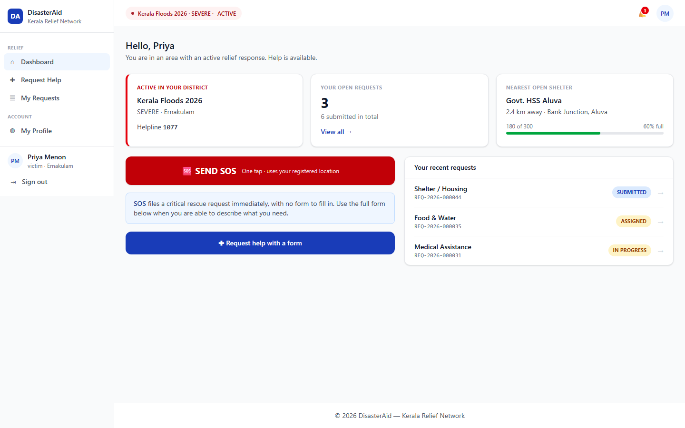
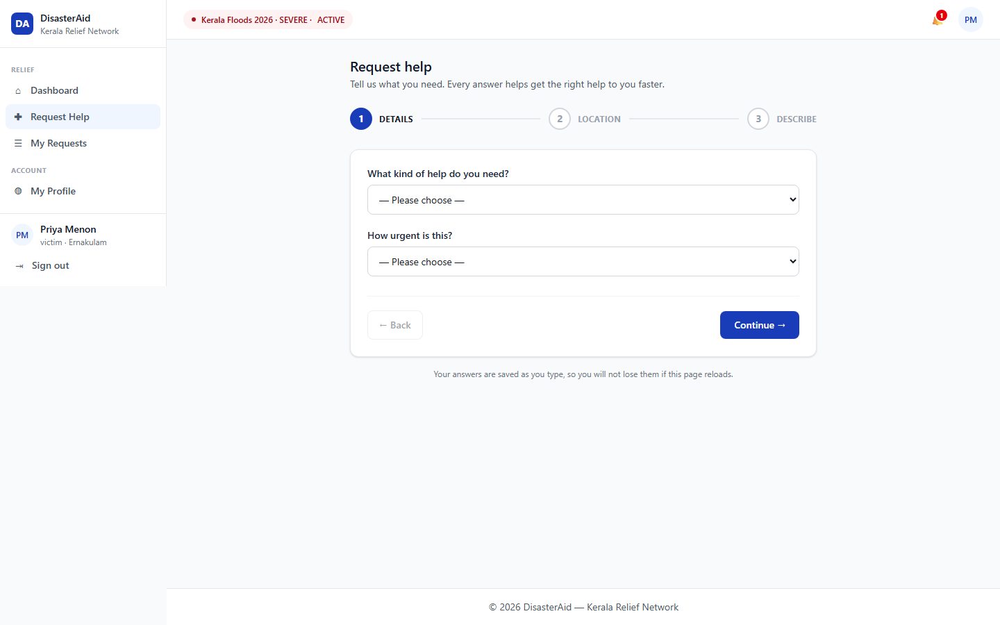
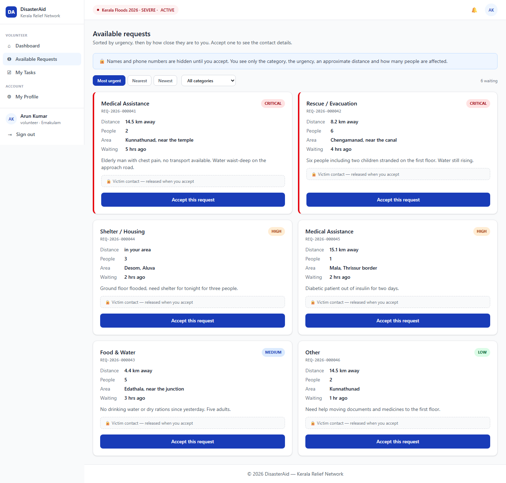
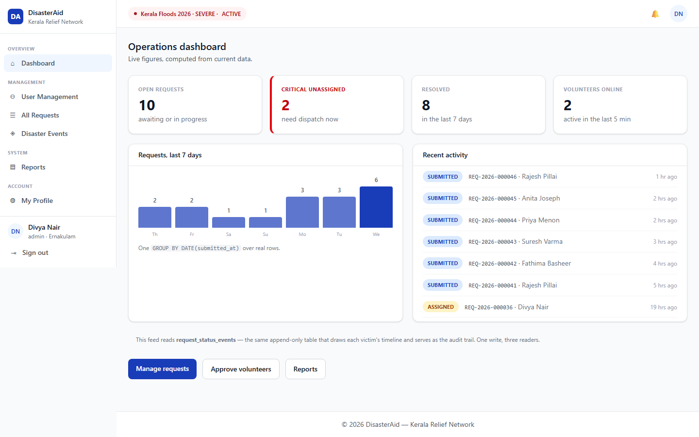

# DisasterAid

A web-based disaster relief coordination system. Victims in a flood-affected district
submit help requests; volunteers nearby claim and fulfil them; administrators approve
volunteers, track every request, and report on the response.

Built as an MCA final-semester project around the Kerala Floods scenario.
Angular 20 + Express 5 + MySQL 8, served from a single origin.

---

## What it does

**Victims** see the active disaster in their district, the nearest open relief camp with a
real distance, and their own open-request count. They submit a help request through a
validated multi-step form, watch its status timeline update, and leave feedback once it is
resolved.

**Volunteers** register, wait for admin approval, then see open requests sorted by urgency
with a real distance to each one. Victim contact details stay hidden until a volunteer
accepts — at which point exactly one volunteer gets the task. They log progress, hours, and
a completion note through an enforced status lifecycle.

**Administrators** approve or reject volunteer registrations, search and deactivate users,
view and assign every request, manage disaster events, and export a help-request summary
as CSV.

## Screens

| | |
|---|---|
|  **Victim dashboard** — active disaster, nearest open camp, SOS |  **Request wizard** — validated step by step |
|  **Open requests** — by urgency and distance, contact withheld |  **Admin dashboard** — live response metrics |

[**docs/SCREENS.md**](docs/SCREENS.md) walks through all 32 screens — every route, dialog,
and wizard step — captured from the running stack with Playwright.

## Engineering notes

The parts of this build that are more than CRUD:

- **One volunteer per request, guaranteed by the database.** Ten simultaneous claims on the
  same request produce exactly one `201` and nine `409`s. MySQL has no partial indexes, so
  `assignments` carries a generated column that is `NULL` unless the assignment is live, and
  a `UNIQUE` index over it — NULLs compare as distinct, so unlimited closed assignments
  coexist with at most one open one. The constraint lives in the schema, not in an
  `if` statement. `npm run race` demonstrates it.
- **Authorization fails closed.** `requireAuth` is mounted on the entire `/api/v1` router
  with an explicit public allowlist, so a route added later without a thought about security
  is protected by default rather than exposed by default.
- **Personal data is released on acceptance, not on listing.** A victim's name, phone, and
  exact address are not in the open-requests payload at all — hiding them in the UI would
  not be security.
- **Append-only audit trail.** The application database account is granted `SELECT` and
  `INSERT` on `request_status_events` and `audit_logs`, but never `UPDATE` or `DELETE`, so
  rewriting history fails at the engine.
- **Single origin, no CORS.** Express serves the built Angular bundle, so the session is one
  `httpOnly` first-party cookie and cross-origin credential handling never arises.
- **Disaster status is derived, never stored.** `ACTIVE` / `UPCOMING` / `PAST` is computed
  from dates on read, so it cannot drift out of agreement with them.

## Stack

| Layer | Choice |
|---|---|
| Frontend | Angular 20 (standalone components, signals, lazy routes), Tailwind CSS 4 |
| Backend | Express 5 on Node 24, TypeScript ESM |
| Database | MySQL 8, raw `mysql2` with parameterised queries |
| Auth | JWT in an `httpOnly` cookie, bcrypt hashing, role guards |
| Validation | Zod contracts shared by client and server (`packages/contracts`) |
| Tests | Vitest + Supertest — 19 integration tests across 8 suites |

13 tables · 28 API endpoints · three roles.

## Quick start

Requires Node 24 (see `.nvmrc`) and Docker.

```bash
git clone https://github.com/JoelJohny/Disaster-Management.git
cd Disaster-Management
npm ci

cp .env.example .env        # defaults work as-is for local development
npm run db:up               # MySQL on :3307, Adminer on :8081, schema + seed auto-loaded
npm run dev                 # API on :3000, Angular dev server on :4200
```

Open <http://localhost:4200>. The Angular dev server proxies `/api` to the backend, so the
app is same-origin in development too.

To run it the way it is demonstrated — one process, no dev server:

```bash
npm run build && npm start  # everything on http://localhost:3000
```

### Demo accounts

All seeded accounts use the password `Password@123`.

| Role | Email |
|---|---|
| Admin | `admin@drms.local` |
| Volunteer (approved) | `arun@drms.local` |
| Volunteer (pending approval) | `meera@drms.local` |
| Victim | `priya@drms.local` |

The seed data is a Kerala Floods scenario: 10 users, 20 help requests, 12 assignments, four
disaster events, and relief camps with real coordinates. Volunteer rating and hour totals
are consistent with the underlying rows — `npm run db:verify` checks that invariant.

### Other scripts

```bash
npm test          # backend integration suite
npm run race      # ten parallel claims against one request
npm run db:reset  # drop and reseed
npm run db:down   # stop containers
```

## Project layout

```
backend/            Express API — routes, services, repositories, middleware
  src/routes/       28 endpoints, one router, auth mounted over all of it
  src/services/     business rules, including the atomic claim transaction
  src/tests/        Supertest integration suite
frontend/           Angular 20 application
  src/app/features/ per-role screens (victim, volunteer, admin)
  src/app/core/     auth store, guards, HTTP interceptors
packages/contracts/ Zod schemas and types shared by both sides
db/                 schema, privilege grants, seed data
docs/               design documents (see below)
```

## Documentation

| Document | What it covers |
|---|---|
| [docs/SCREENS.md](docs/SCREENS.md) | Every screen in the running app, with screenshots |
| [docs/RUNBOOK.md](docs/RUNBOOK.md) | Cold start, daily start, reset, and what to do when something breaks |
| [docs/API.md](docs/API.md) | All 28 endpoints, auth flow, error model |
| [docs/DATABASE.md](docs/DATABASE.md) | The 13 tables, the atomic-claim guarantee, MySQL-specific decisions |
| [docs/FRONTEND.md](docs/FRONTEND.md) | Per-screen wiring, signal-store and typed-form patterns |
| [docs/DEVENV.md](docs/DEVENV.md) | docker-compose, npm scripts, same-origin setup |
| [docs/user-map.html](docs/user-map.html) | Visual route map, access-control matrix, status lifecycle — open in a browser |
| [docs/PLAN.md](docs/PLAN.md) | Scope, schedule, risks |

## Security note

This is a demonstration project. The seeded accounts above are public and share a known
password, and `.env.example` ships a development-only JWT secret. Any deployment reachable
by anyone else needs a fresh `JWT_SECRET`, a seed without the published credentials, and
`NODE_ENV=production` so the session cookie is issued with `Secure`.

## License

MIT — see [LICENSE](LICENSE).
