# DisasterAid — screen-by-screen walkthrough

Every page of the running application, captured from the live stack, with what each
screen does and where it sits in the workflow.

Screenshots live in [`screenshots/`](screenshots/) — 32 images covering every route in
`frontend/src/app/app.routes.ts`, plus the dialogs and wizard steps that a plain page
load never shows.

**How these were captured.** MySQL 8 (Docker, `drms-mysql`) with the Kerala Floods 2026
seed, the Express API on `:3000`, and `ng serve` on `:4200`. Playwright drove a real
Chromium at 1440×900 and took full-page shots, signing in as each role through
`POST /api/v1/auth/login`. Dialogs were opened and dismissed without submitting, so the
seed data is unchanged (20 requests, 12 assignments, 6 feedback rows before and after).

**Demo accounts** — all use the password `Password@123`:

| Role | Email | Who |
| --- | --- | --- |
| Admin | `admin@drms.local` | Divya Nair |
| Volunteer (approved) | `arun@drms.local` | Arun Kumar |
| Volunteer (pending) | `meera@drms.local` | Meera Thomas |
| Victim | `priya@drms.local` | Priya Menon |

---

## Contents

1. [The spine: one request's lifecycle](#1-the-spine-one-requests-lifecycle)
2. [Getting in](#2-getting-in) — login, registration, error pages
3. [The victim journey](#3-the-victim-journey)
4. [The volunteer journey](#4-the-volunteer-journey)
5. [The admin journey](#5-the-admin-journey)
6. [Shared screens and chrome](#6-shared-screens-and-chrome)
7. [Design decisions worth knowing](#7-design-decisions-worth-knowing)
8. [Issues found while documenting](#8-issues-found-while-documenting)

---

## 1. The spine: one request's lifecycle

Everything in the app orbits a single row in `requests` moving through five states. The
permitted moves are a server-side table in
`backend/src/services/requests.service.ts`, not a UI convention:

```
                 volunteer claims / admin assigns
   SUBMITTED ─────────────────────────────────────►  ASSIGNED
      │  ▲                                              │  │
      │  │            volunteer releases                │  │  volunteer starts
      │  └──────────────────────────────────────────────┘  ▼
      │                                              IN_PROGRESS
      │                                                 │   │
      │  victim/admin cancels                           │   │ volunteer completes
      ▼                                                 │   ▼
  CANCELLED  (terminal)                                 │  COMPLETED (terminal)
                                                        │      │
                                  release ──────────────┘      ▼
                                  (back to SUBMITTED)     victim rates once
```

```js
const TRANSITIONS = {
  SUBMITTED:   ['ASSIGNED', 'CANCELLED'],
  ASSIGNED:    ['IN_PROGRESS', 'SUBMITTED', 'CANCELLED'],  // back to SUBMITTED = released
  IN_PROGRESS: ['COMPLETED', 'SUBMITTED'],
  COMPLETED:   [],
  CANCELLED:   [],
};
```

Three consequences that shape the screens:

- **`ASSIGNED → COMPLETED` is refused.** A volunteer must start a task before finishing
  it. The "My tasks" page deliberately still renders a *Mark completed — skips a step*
  button so you can watch the server return `400 ILLEGAL_TRANSITION`.
- **`IN_PROGRESS → CANCELLED` is refused.** Once a volunteer is on the way, the victim
  can no longer cancel.
- **`COMPLETED` and `CANCELLED` are terminal.** This is what stops a second completion
  double-crediting a volunteer's hours.

An assignment carries its own status — `ASSIGNED → IN_PROGRESS → COMPLETED`, or
`ASSIGNED`/`IN_PROGRESS → RELEASED`. Every change appends a row to
`request_status_events`, which is append-only *by database grant* (`db/02-grants.sql`):
the application account holds `INSERT` but not `UPDATE` or `DELETE`. That one table
feeds the victim's timeline, the admin's activity feed and the audit trail.

---

## 2. Getting in

### 2.1 Sign in — `/auth/login`

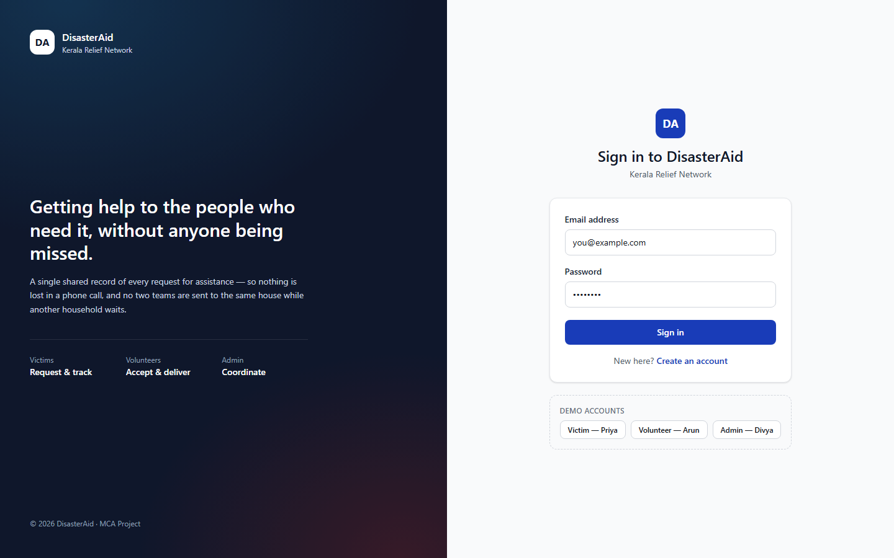

The single front door. A dark brand panel carries the project's thesis — *"A single
shared record of every request for assistance — so nothing is lost in a phone call, and
no two teams are sent to the same house while another household waits."* The card on
the right takes an email and password.

- **Sign in** → `POST /api/v1/auth/login`; the server sets an HTTP-only session cookie
  and returns the user, then the app routes by role: admin → `/dashboard`, volunteer →
  `/volunteer/dashboard`, victim → `/victim/dashboard`.
- **Demo account chips** (*Victim — Priya*, *Volunteer — Arun*, *Admin — Divya*) fill
  the form client-side. No API call.
- Deep-linking while signed out lands here with `?redirect=<path>`; a session that dies
  mid-use lands here with `?expired=1` and an amber *"Your session ended"* banner.

Login deliberately compares against a dummy bcrypt hash when the email is unknown, so
response timing and wording are identical whether or not the account exists. Both
`/auth/login` and `/auth/register` are rate-limited to 30 attempts per 15 minutes.

There is no password-reset flow — no link and no endpoint.

### 2.2 Create your account — `/auth/register`

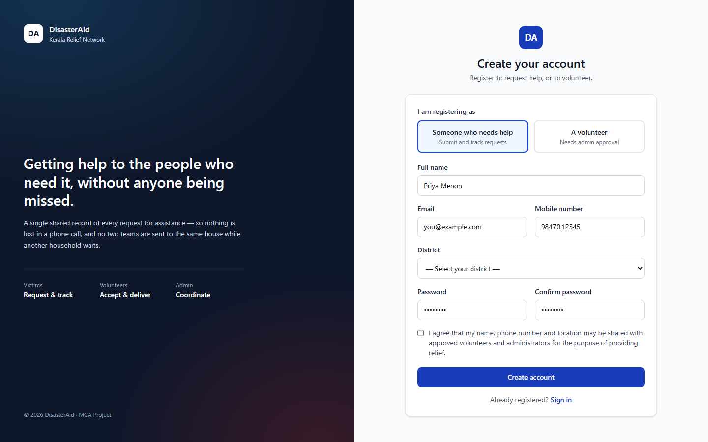

Self-registration, limited to two roles. Picking **A volunteer** reveals an amber note
that an administrator must approve the account first; picking **Someone who needs help**
does not, because victims have no approval gate. The district list is the 14 Kerala
districts from `packages/contracts`.

- **Create account** → `POST /api/v1/auth/register`, which creates the user, signs them
  in immediately, and for a volunteer also creates a `volunteer_profiles` row hard-coded
  to `PENDING`.
- Admin accounts cannot be self-registered — the contract rejects any role but
  `VICTIM` or `VOLUNTEER`.

> ⚠️ **This page is unreachable in the running app.** See
> [issue 1](#81-registration-is-unreachable-while-signed-out). The screenshot above was
> captured with the lookup call stubbed, so it shows the page as designed.

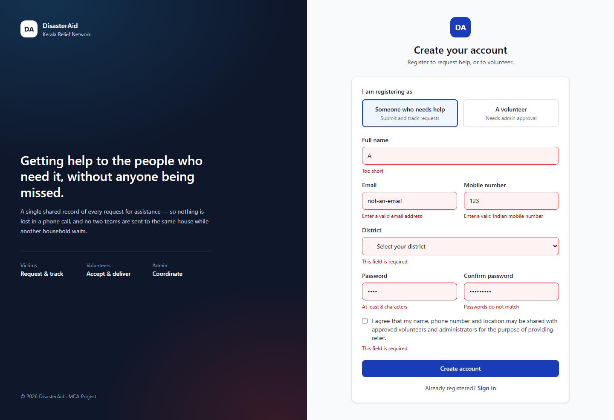

The validation state. Rules enforced: name ≥ 2 characters, a valid email, an Indian
mobile (`^(\+?91[\s-]?)?[6-9]\d{4}[\s-]?\d{5}$`), a district, a password of ≥ 8
characters containing lower, upper and a digit, a matching confirmation, and the consent
tick. The same zod schemas back both the Angular form and the server, so a tightened
server rule cannot be bypassed by a crafted request.

### 2.3 Forbidden — `/forbidden`

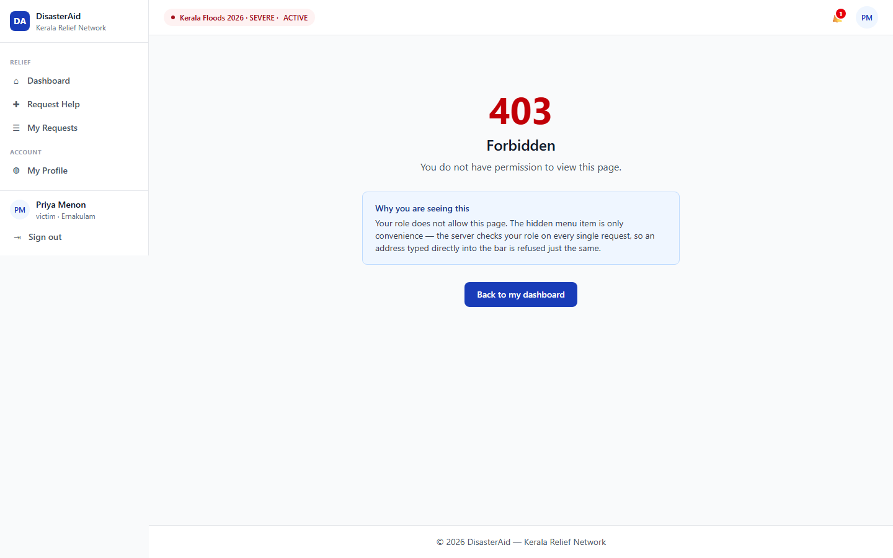

Reached here by a victim requesting `/dashboard`, an admin route. Angular's `roleGuard`
redirects rather than rendering; the guard's own source documents it as convenience
only — the real gate is `requireRole` on the server, which returns `403` regardless of
what the client does.

### 2.4 Not found — `/**`

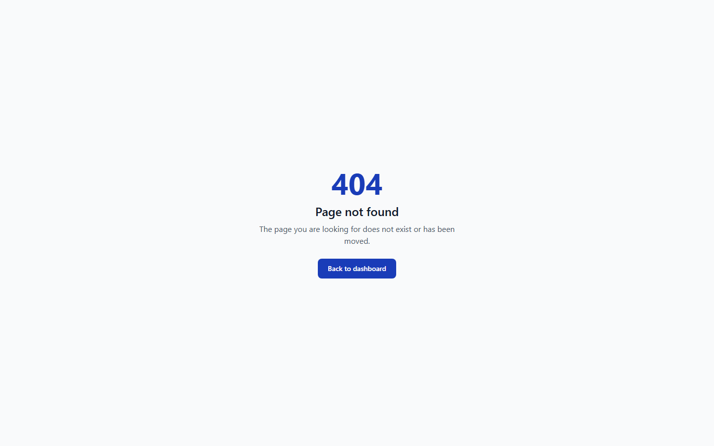

The catch-all route, outside the authenticated layout, so it renders without the sidebar.

---

## 3. The victim journey

**The workflow in one line:** register → land on the dashboard → raise a request (one
tap or the full form) → watch it move → cancel while it is still early, or rate the help
once it is done.

### 3.1 Victim dashboard — `/victim/dashboard`


The landing page, built to be usable by someone in distress. Three cards across the top:
the active disaster in their district (*Kerala Floods 2026, SEVERE, Helpline 1077*),
their open request count (*3*, with *6 submitted in total*), and the nearest open shelter
with a capacity bar (*Govt. HSS Aluva, 2.4 km away, 180 of 300, 60% full*).

Below that, the two ways to ask for help, ordered by urgency of need:

- **SEND SOS** — a full-width red bar. One tap, no form.
- **Request help with a form** — the three-step wizard, for when the person can describe
  what they need.

The right column lists the three most recent requests with live status pills.

### 3.2 The SOS path

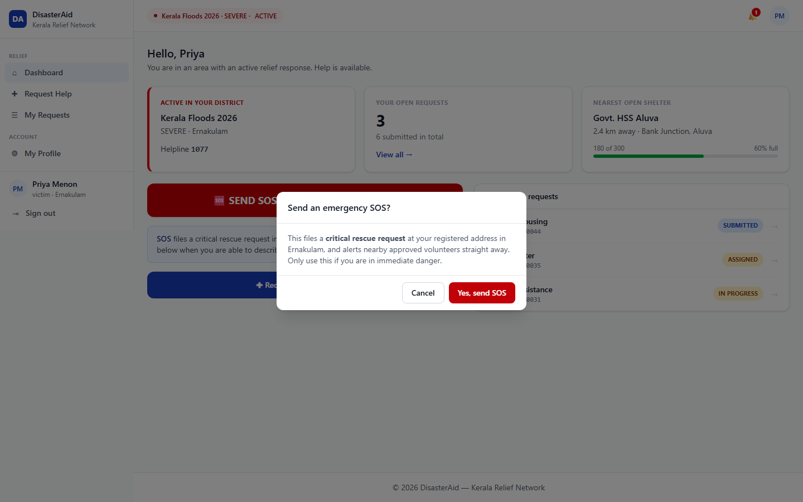

SOS is not a single misfire away. The confirm dialog explains exactly what will happen:
*"This files a critical rescue request at your registered address in Ernakulam, and
alerts nearby approved volunteers straight away. Only use this if you are in immediate
danger."*

Confirming posts a fixed body to `POST /api/v1/requests` — category `RESCUE`, urgency
`CRITICAL`, the account's own district, `peopleCount` 1, and a canned description. The
request enters the pool as `SUBMITTED` like any other.

### 3.3 The form path — `/victim/submit-request`

A three-step wizard. Every keystroke mirrors to `sessionStorage`, so a refresh mid-form
loses nothing — the page says so at the bottom.

| Step 1 — Details | Step 2 — Location | Step 3 — Describe |
| --- | --- | --- |
|  | 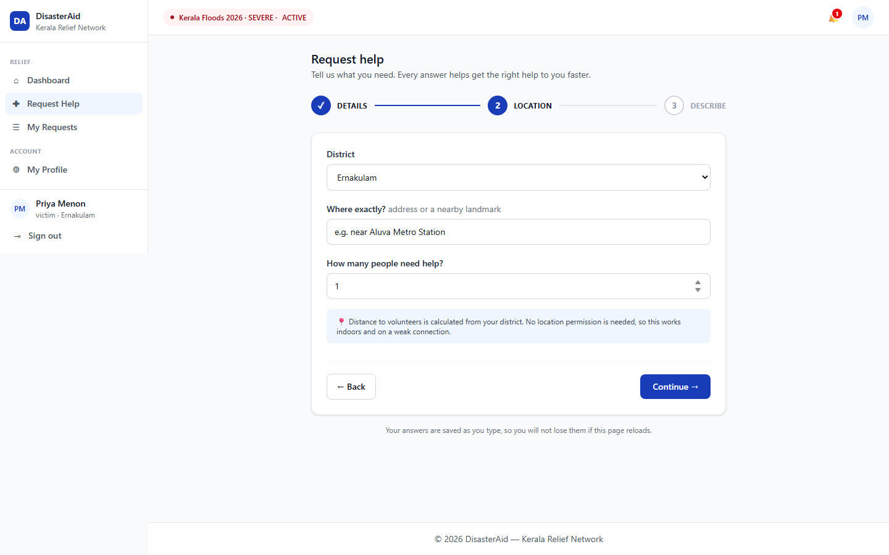 | 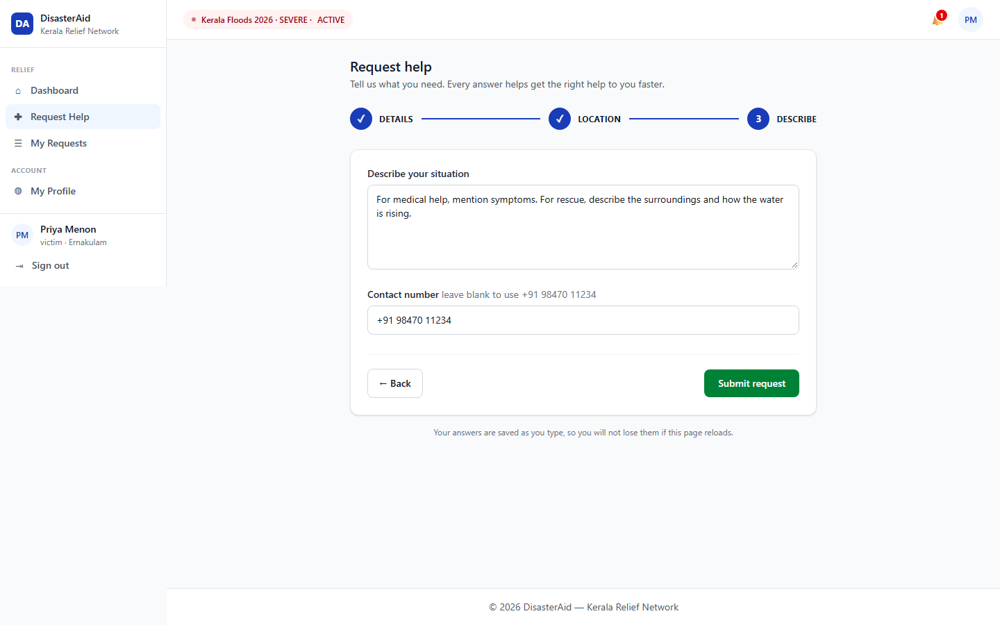 |

1. **Details** — what kind of help, and how urgent. The urgency options are written as
   plain consequences rather than labels: *"Critical — life is at risk right now"*,
   *"High — needed within hours"*, *"Medium — needed today"*, *"Low — this can wait"*.
2. **Location** — district (prefilled from the account), a landmark in free text, and
   how many people are affected.
3. **Describe** — the free-text description and a contact number.

**Continue** gates on the current step only, so the user is never blocked by a field they
have not reached. Submitting calls `POST /api/v1/requests`, which mints a
`REQ-YYYY-NNNNNN` reference inside the transaction, derives coordinates from the
district, attaches whichever active disaster covers the location, and writes the first
timeline row.

### 3.4 My requests — `/victim/my-requests`

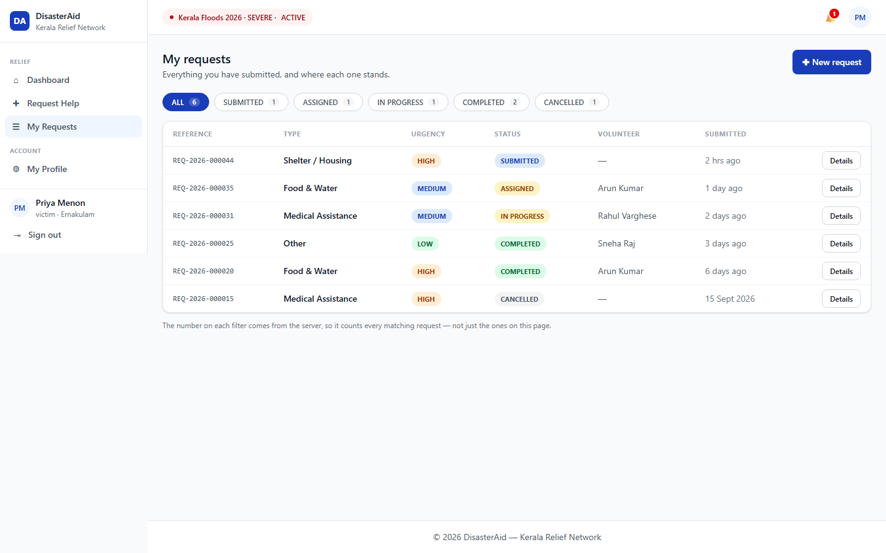

Everything the victim has submitted, with filter pills carrying server-computed counts
(*ALL 6, SUBMITTED 1, ASSIGNED 1, IN PROGRESS 1, COMPLETED 2, CANCELLED 1*). The table
shows reference, type, urgency, status, the assigned volunteer's name once there is one,
and relative time.

The page notes that the number on each pill comes from the server, so it counts every
matching request rather than just the current page.

### 3.5 Request detail — `/requests/:id`

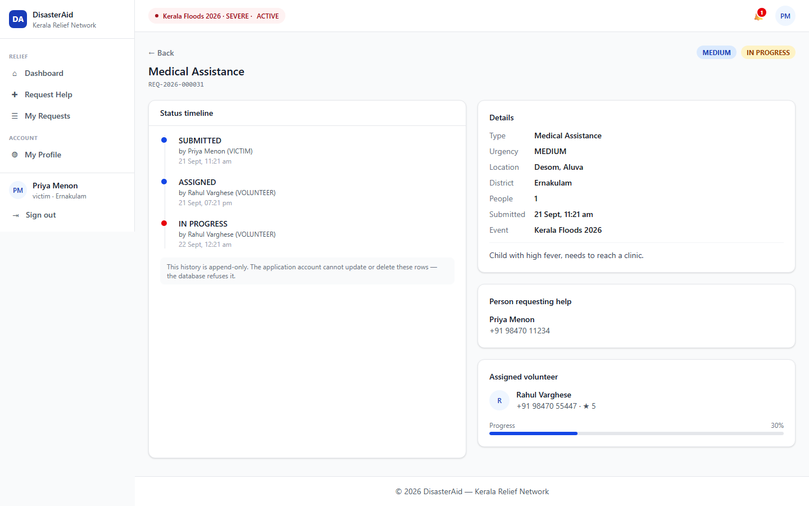

The single-request view, and the clearest window onto the workflow. The left column is
the **status timeline** — `SUBMITTED` by Priya Menon (VICTIM), `ASSIGNED` by Rahul
Varghese (VOLUNTEER), `IN PROGRESS` by Rahul Varghese (VOLUNTEER) — each with actor,
role and timestamp. The note beneath it is accurate: *"This history is append-only. The
application account cannot update or delete these rows — the database refuses it."*

The right column carries the details, the requesting person, and — once assigned — the
volunteer's name, phone, rating and a progress bar (*30%*).

From here the victim can **Cancel request** (offered only while the request is still
`SUBMITTED`) and, once completed, **Rate this help**.

### 3.6 Leave feedback — `/victim/feedback/:requestId`

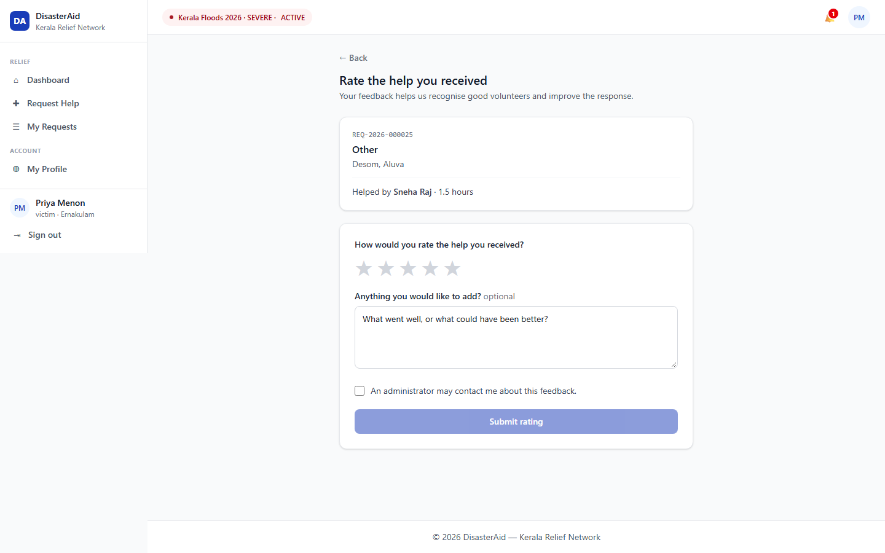

Shown for `REQ-2026-000025`, completed by Sneha Raj in 1.5 hours. A 1–5 star control
(arrow keys work), an optional comment, and an optional *"An administrator may contact me
about this feedback"* tick.

Submitting calls `POST /api/v1/requests/:id/feedback`, which refuses unless the caller
owns the request and it is `COMPLETED`. A unique index allows exactly one rating per
request. The write recomputes the volunteer's `rating_avg` and `rating_count` across all
their feedback — which then feeds the ordering in the admin's assign dialog. This is the
only path by which a volunteer's reputation changes.

### 3.7 Notifications

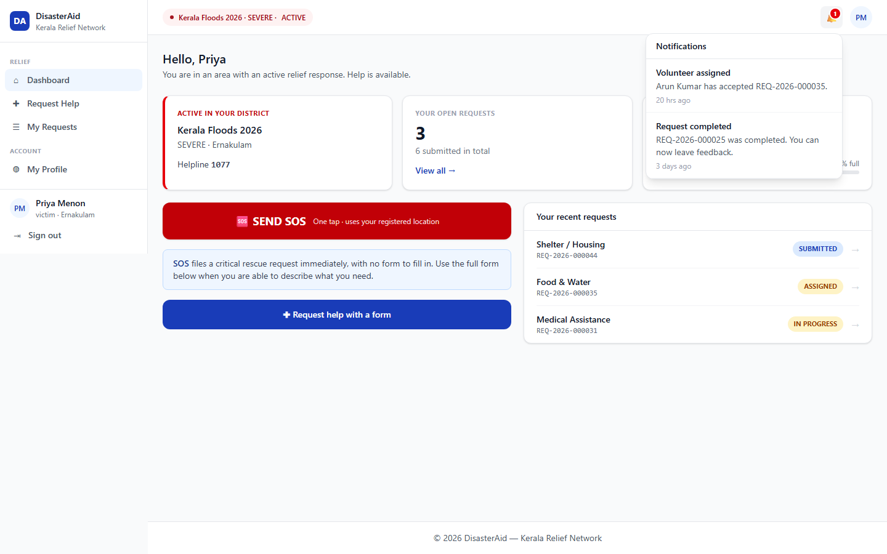

The bell polls `GET /api/v1/notifications` every 20 seconds — deliberate polling, not
WebSockets. Rows are written by the *other* actors: *"Volunteer assigned — Arun Kumar has
accepted REQ-2026-000035"* and *"Request completed — REQ-2026-000025 was completed. You
can now leave feedback."* The second is what tells a victim that rating is unlocked.

---

## 4. The volunteer journey

**The workflow in one line:** register → wait for approval → browse an anonymised pool →
accept → start → record progress → complete and log hours → the victim's rating accrues
to your profile.

### 4.1 The approval gate — `/volunteer/dashboard` while `PENDING`

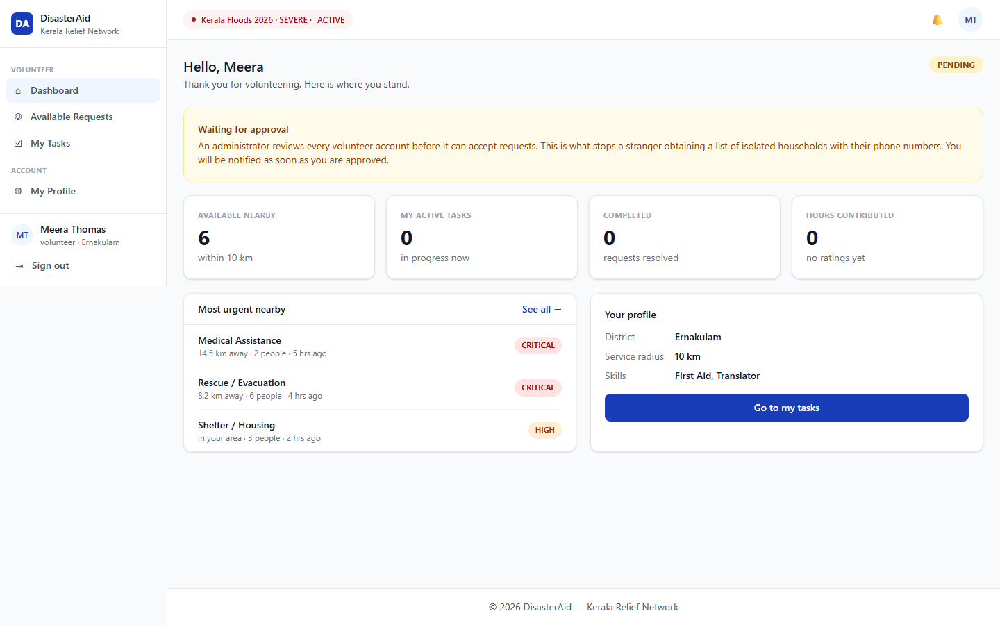

Meera Thomas, registered five days ago, still `PENDING`. An amber pill sits top-right and
an amber panel explains the gate in terms of the risk it manages: *"An administrator
reviews every volunteer account before it can accept requests. This is what stops a
stranger obtaining a list of isolated households with their phone numbers."*

A pending volunteer is fully signed in and can read the pool — their KPIs are all zero
(*MY ACTIVE TASKS 0, COMPLETED 0, HOURS CONTRIBUTED 0, no ratings yet*) but *AVAILABLE
NEARBY 6* is real. What they cannot do is claim: the server rejects that with `403`.

### 4.2 Approved dashboard — `/volunteer/dashboard`

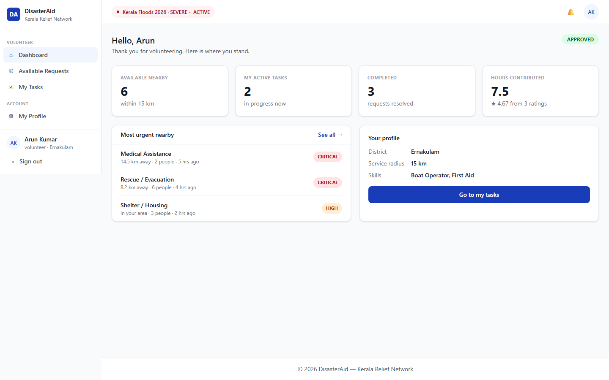

The same screen for Arun Kumar, approved. The pill reads APPROVED, the amber panel is
gone, and the KPIs carry real figures: *AVAILABLE NEARBY 6 (within 15 km)*, *MY ACTIVE
TASKS 2*, *COMPLETED 3*, *HOURS CONTRIBUTED 7.5 (★ 4.67 from 3 ratings)*. The profile
card shows district, service radius and skills — the radius is what scopes "nearby".

### 4.3 Available requests — `/volunteer/available-tasks`


The pool, and the most interesting screen in the app for privacy design. A blue banner
states the rule plainly: *"Names and phone numbers are hidden until you accept. You see
only the category, the urgency, an approximate distance and how many people are
affected."* Each card carries a locked strip reading *"Victim contact — released when you
accept."*

Sorting is **Most urgent** (default), **Nearest** or **Newest**, with a category filter
and a *6 waiting* counter. The query returns only `SUBMITTED` requests with no active
assignment, so a claimed request disappears from every other volunteer's list.

**Accept this request** → `POST /api/v1/requests/:id/claim`. This is the app's
concurrency showpiece, defended in three layers:

1. A transaction takes `SELECT ... FOR UPDATE` on the request row, serialising
   simultaneous claimers.
2. The update is conditional — `WHERE id = ? AND status = 'SUBMITTED'`.
3. A `UNIQUE` index on a **stored generated column** (`active_request_id`, which equals
   the request id only while the assignment is `ASSIGNED`/`IN_PROGRESS`) makes
   double-dispatch impossible at the database level.

Exactly one claimer gets `201`; the rest get `409 ALREADY_CLAIMED` naming the winner.
Releasing the contact details is audited with `pii_revealed = TRUE`.

### 4.4 My tasks — `/volunteer/my-tasks`

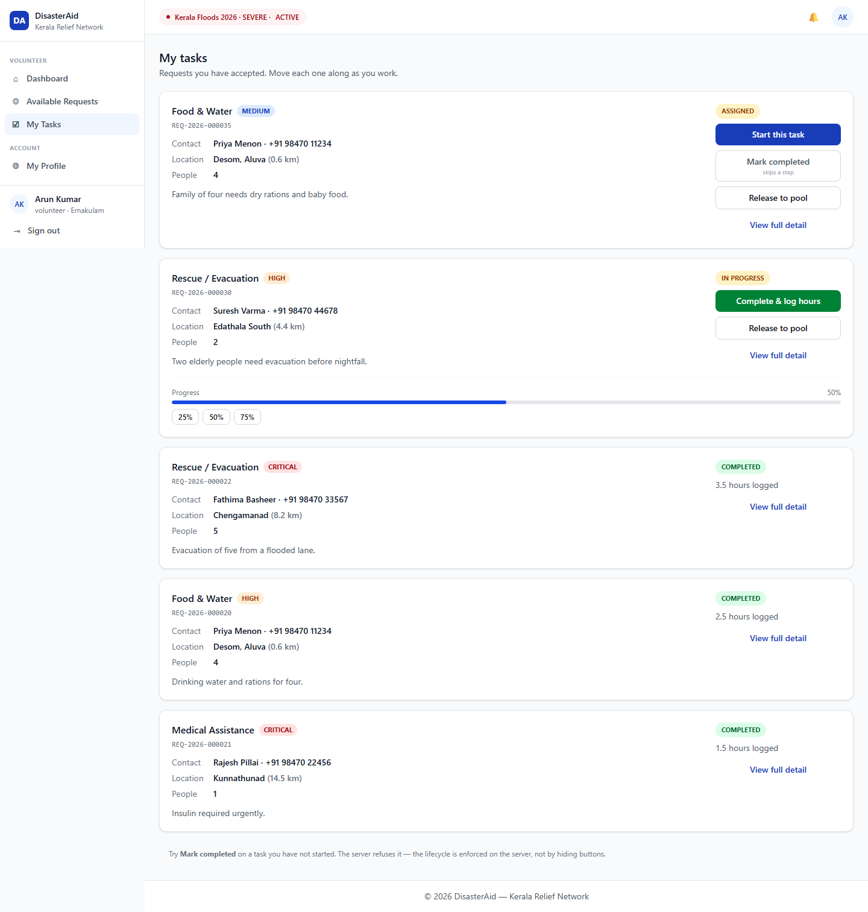

Accepted work, with the victim's name and phone now visible, and distance from the
volunteer's own district. Controls change with status:

| Card status | Controls offered |
| --- | --- |
| `ASSIGNED` | **Start this task**, *Mark completed — skips a step*, **Release to pool** |
| `IN_PROGRESS` | **Complete & log hours**, **Release to pool**, progress chips 25% / 50% / 75% |
| `COMPLETED` | read-only, showing hours logged |

The footer states the design principle: *"Try Mark completed on a task you have not
started. The server refuses it — the lifecycle is enforced on the server, not by hiding
buttons."*

**Release to pool** is the escape hatch: it sets the assignment to `RELEASED` and returns
the request to `SUBMITTED`, freeing the unique index so someone else can take it.

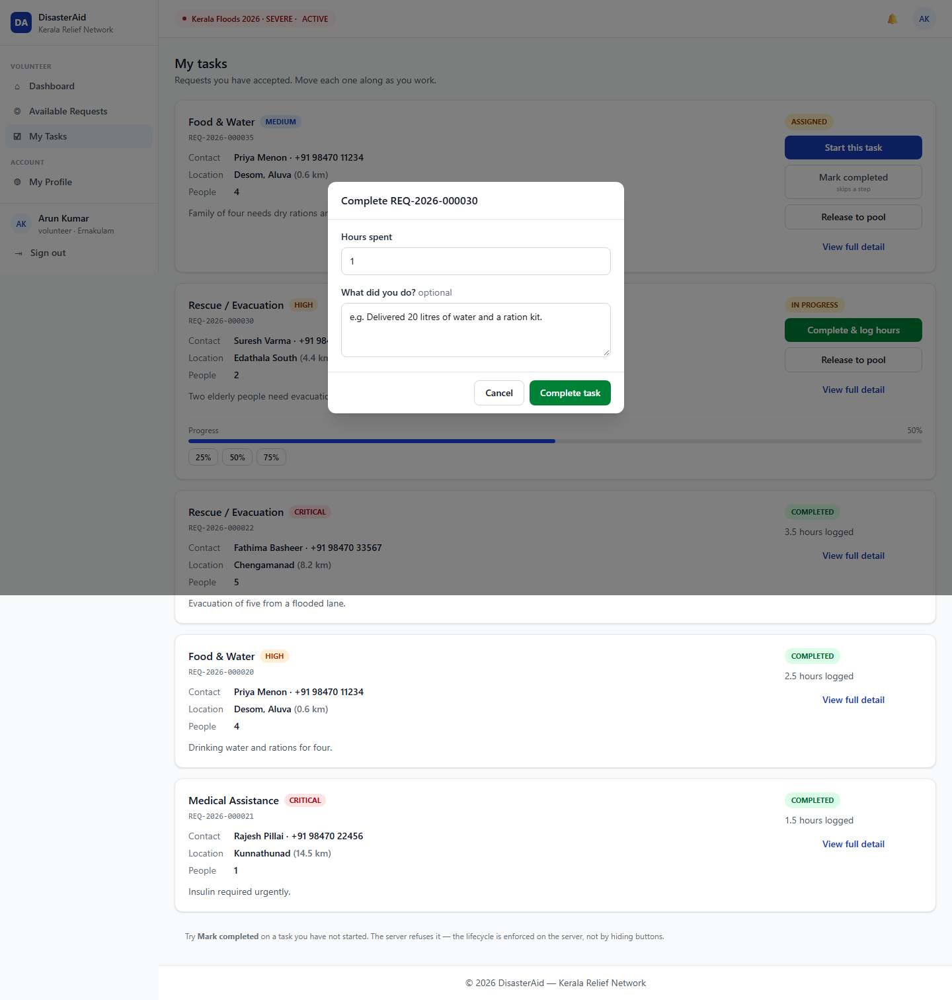

**Complete & log hours** opens a dialog for hours spent (prefilled 1, step 0.5) and an
optional note. Confirming sets both rows to `COMPLETED`, forces progress to 100, and
increments the volunteer's `hours_logged` and `completed_count` in the same transaction —
which is why the totals on screen always reconcile with the assignment rows.

### 4.5 Volunteer's request detail and profile

| Request detail | Profile |
| --- | --- |
| 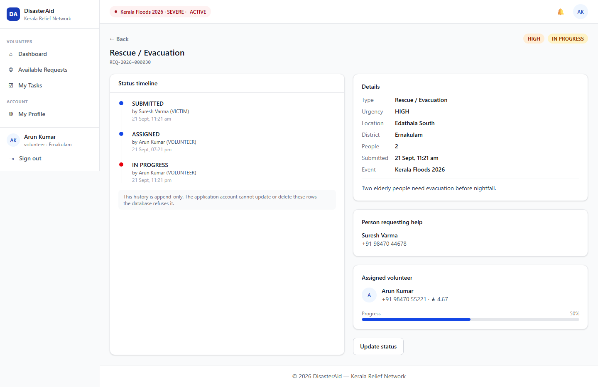 | 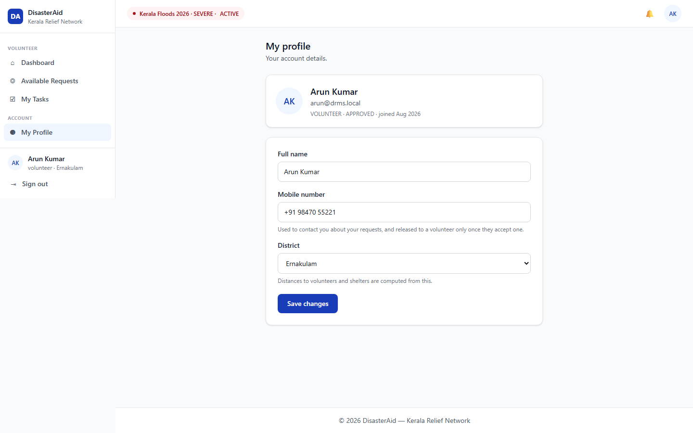 |

The detail view is the same component the victim sees, scoped differently: a volunteer
may read a request they are assigned to, or any request still `SUBMITTED` (that is what
makes the pool browsable). Anything else returns `404` rather than `403`, so the API does
not confirm that a request exists.

The profile shows `VOLUNTEER · APPROVED · joined …` as read-only text and allows editing
name, mobile and district. District is operationally significant: it is the origin for
every distance shown on the available-requests screen.

---

## 5. The admin journey

**The workflow in one line:** monitor the operation → approve volunteers → triage and
dispatch requests → declare disaster events → read the reports.

### 5.1 Operations dashboard — `/dashboard`


Four live counters — *OPEN REQUESTS 10*, *CRITICAL UNASSIGNED 2 (need dispatch now)*,
*RESOLVED 8 (in the last 7 days)*, *VOLUNTEERS ONLINE 2 (active in the last 5 min)* —
with the critical tile outlined in red because it is the one demanding action.

A 7-day bar chart of submissions sits beside a recent-activity feed. Both annotate their
own provenance: *"One `GROUP BY DATE(submitted_at)` over real rows"* and *"This feed
reads `request_status_events` — the same append-only table that draws each victim's
timeline and serves as the audit trail. One write, three readers."*

### 5.2 User management — `/admin/user-management`

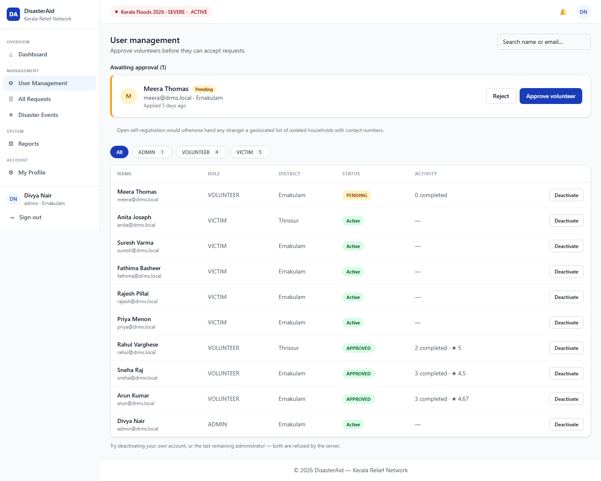

The approval queue first: *Awaiting approval (1)* — Meera Thomas, with **Approve
volunteer** and **Reject**. The justification is printed underneath: *"Open
self-registration would otherwise hand any stranger a geolocated list of isolated
households with contact numbers."*

Below, every user with role, district, status and activity (completed count and rating).
**Deactivate** bumps a `token_version`, which signs that person out of every device at
once — there is no server-side session store to sweep.

Two guardrails, stated on the page and enforced on the server: *"Try deactivating your
own account, or the last remaining administrator — both are refused by the server."*

### 5.3 All requests — `/admin/all-requests`

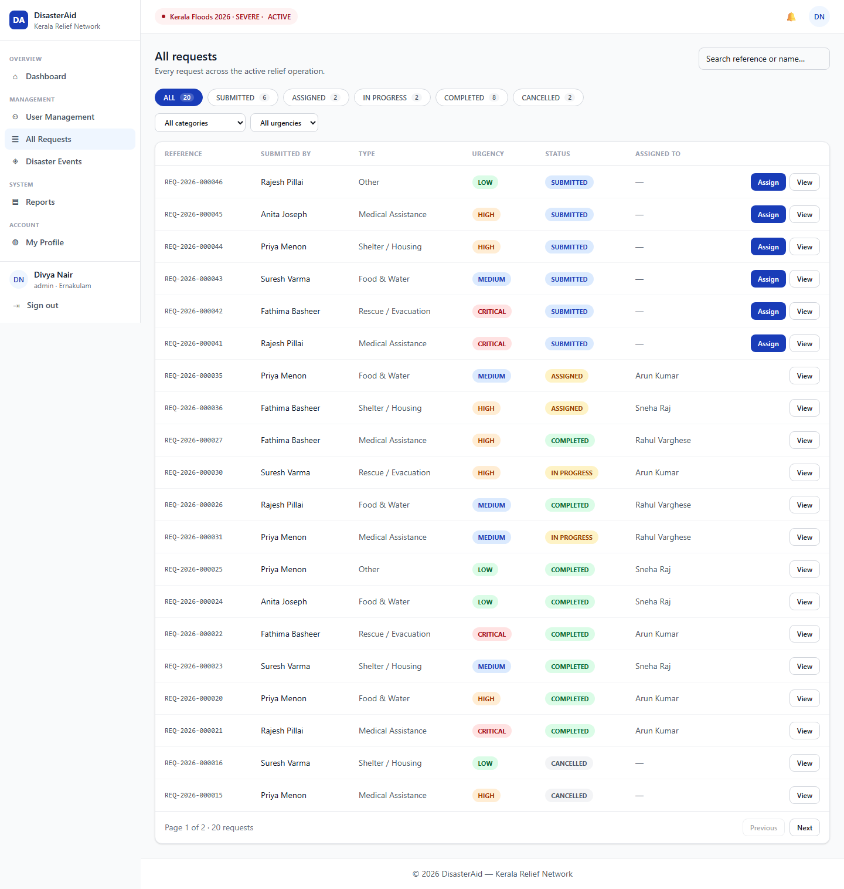

The triage queue, and the only screen permitted `scope=all`. Status pills with counts
(*ALL 20, SUBMITTED 6, ASSIGNED 2, IN PROGRESS 2, COMPLETED 8, CANCELLED 2*), category and
urgency selects, and a search box that matches reference, location text **or** victim
name.

Unassigned rows carry an **Assign** button; assigned rows show the volunteer's name and
only **View**.

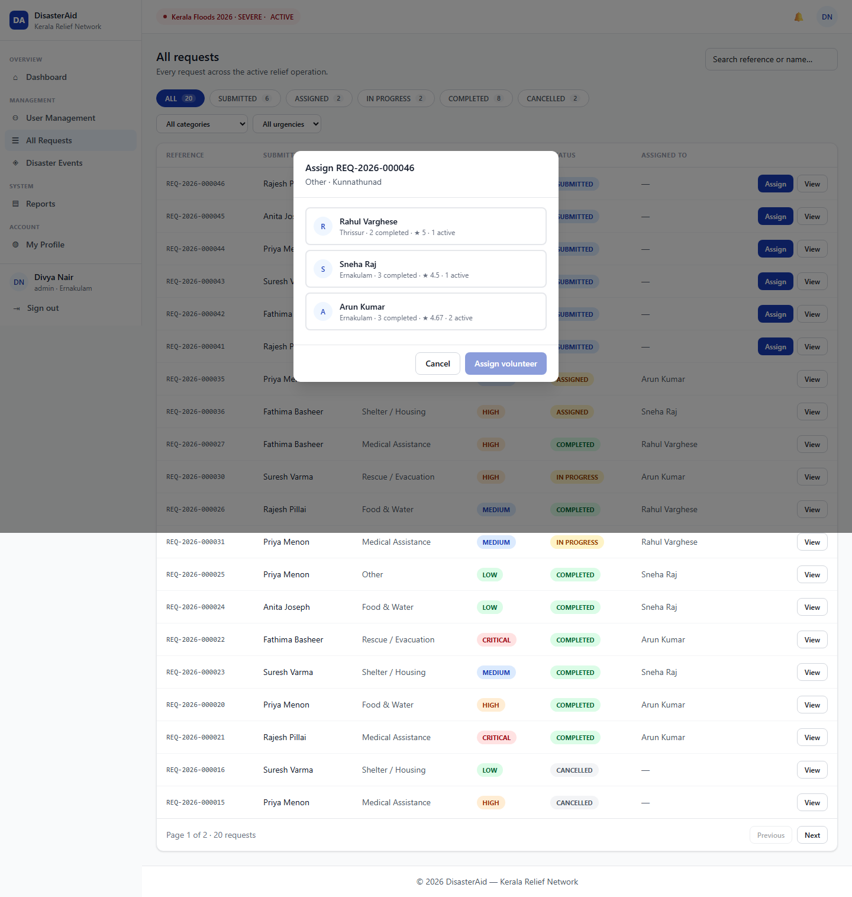

The assign dialog is a dispatcher's tool: each candidate shows district, completed count,
rating and **current load** (*1 active*, *2 active*), ordered by fewest active tasks then
highest rating. Only approved, active volunteers are listed.

Confirming calls `POST /api/v1/requests/:id/assign`, which — importantly — delegates to
*the same* `claim()` service a volunteer uses. Admin dispatch and volunteer self-claim
therefore contend on one lock and one unique index; whoever loses gets
`409 ALREADY_CLAIMED`.

### 5.4 Disaster events — `/admin/disaster-management`

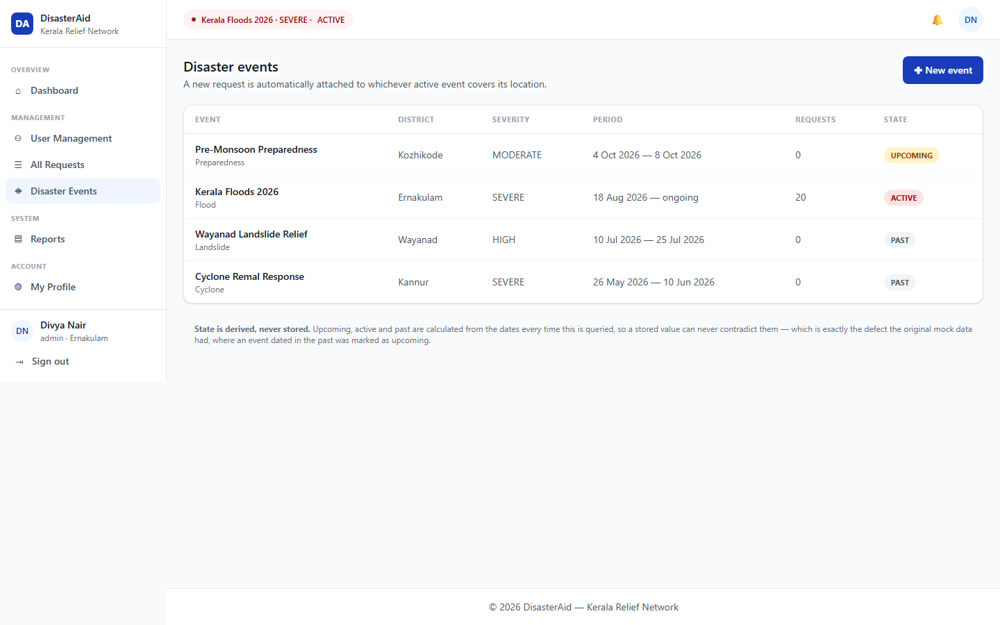

The events a request can attach to: *"A new request is automatically attached to whichever
active event covers its location."* Four events across UPCOMING, ACTIVE and PAST, with a
request count per event.

The page explains a deliberate modelling choice: *"State is derived, never stored.
Upcoming, active and past are calculated from the dates every time this is queried, so a
stored value can never contradict them — which is exactly the defect the original mock
data had, where an event dated in the past was marked as upcoming."*

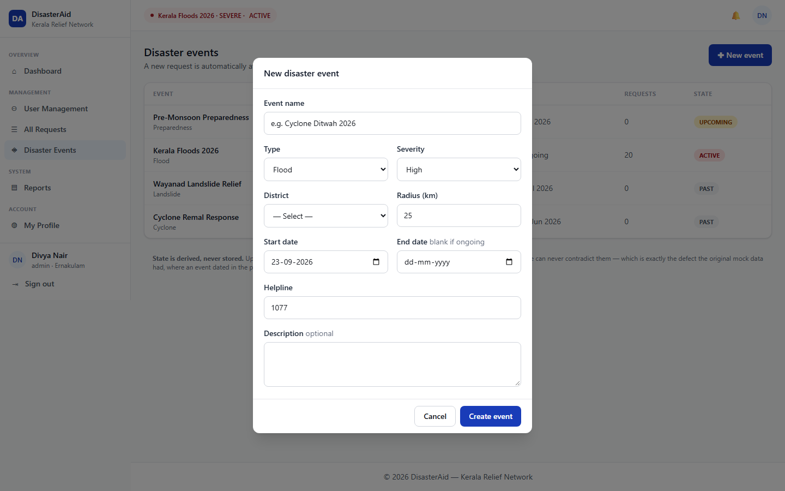

**New event** opens a form for title, type, severity, district, radius, dates, helpline
and description. Note that events can only be *created* — there is no edit or delete
endpoint.

### 5.5 Reports — `/admin/system-reports`

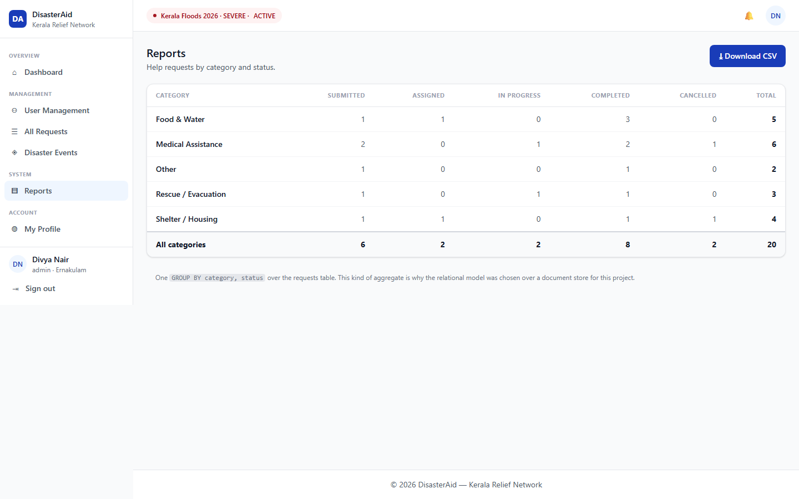

A category × status cross-tab with row and column totals (20 requests overall), and a
**Download CSV** export. The footnote makes the architectural argument: *"One `GROUP BY
category, status` over the requests table. This kind of aggregate is why the relational
model was chosen over a document store for this project."*

### 5.6 Admin's request detail

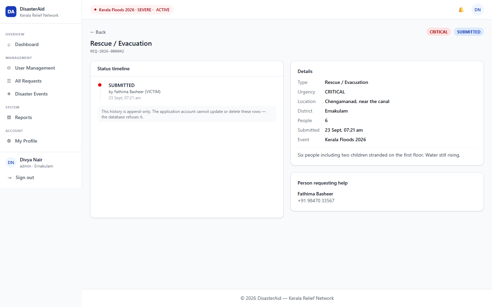

`REQ-2026-000042` — critical, unassigned. The admin sees every request unconditionally,
including full contact details, with no `pii_revealed` audit row (unlike a volunteer's
claim).

---

## 6. Shared screens and chrome

### 6.1 Profile — `/profile`

| Victim | Admin |
| --- | --- |
| 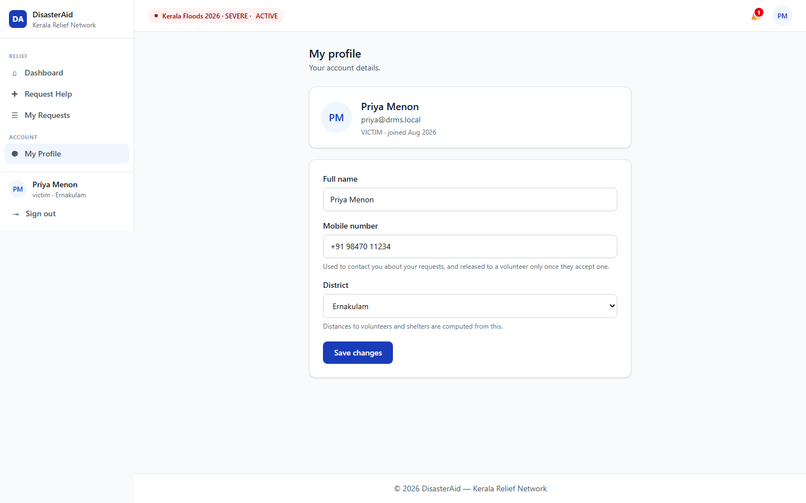 | 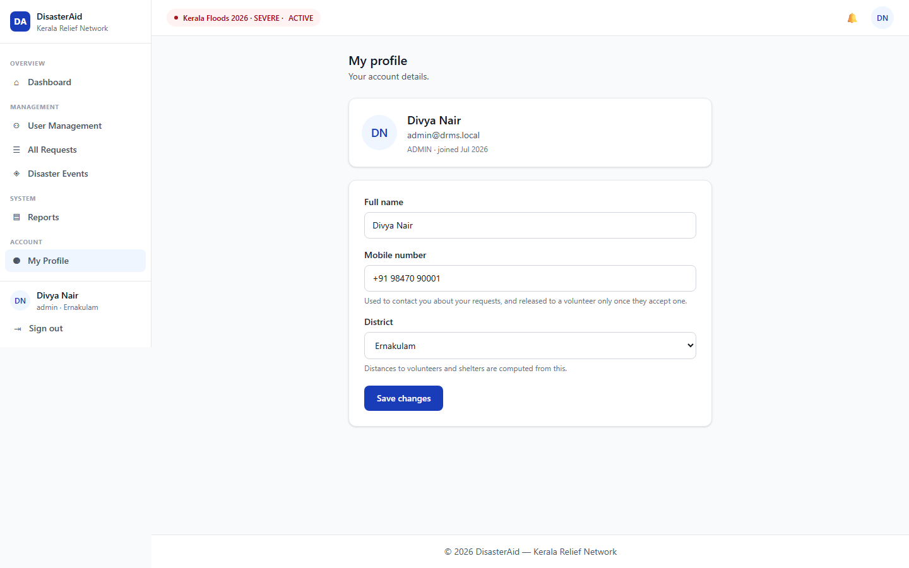 |

One component for all three roles. Editable: full name, mobile, district. Read-only:
email, role and — for volunteers — approval status.

### 6.2 Account menu

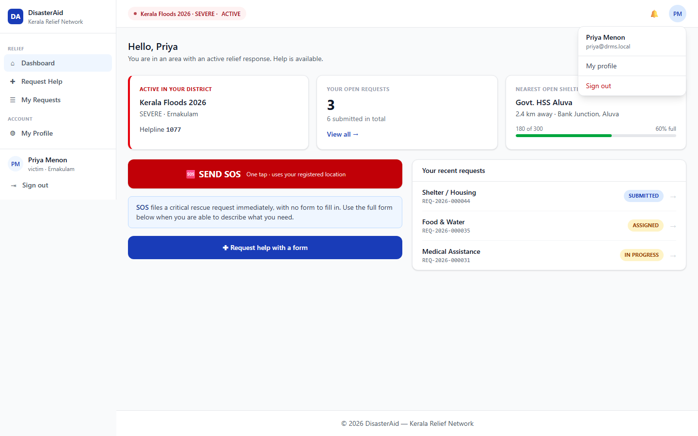

The avatar menu: **My profile** and **Sign out**. Signing out clears the cookie
server-side and nulls the client store.

### 6.3 The shell

Every authenticated page shares a role-aware sidebar (victim: Dashboard / Request Help /
My Requests; volunteer: Dashboard / Available Requests / My Tasks; admin: Dashboard /
User Management / All Requests / Disaster Events / Reports), a header carrying the active
disaster banner, the notification bell and the account menu, and a footer.

---

## 7. Design decisions worth knowing

- **Deny by default.** `requireAuth` is mounted on the entire `/api/v1` router. Only a
  short allowlist is public: register, login, logout, `auth/me` and `health`.
- **Client guards are convenience, not security.** The Angular `roleGuard` says so in its
  own source; every rule is re-enforced server-side with `requireRole`.
- **PII is released late and audited.** A volunteer sees no name or phone until they
  accept, and the release is written to `audit_logs` with `pii_revealed = TRUE`.
- **The approval gate is the main privacy control** — `requireApprovedVolunteer` blocks
  claiming until an admin acts.
- **Double-dispatch is prevented by the database**, not by an `if` statement — a unique
  index on a stored generated column, with MySQL error 1062 mapped to
  `409 ALREADY_CLAIMED` and deadlocks mapped to a retry-friendly error.
- **The audit trail is enforced by `GRANT`.** The app account cannot `UPDATE` or `DELETE`
  `request_status_events`.
- **Derived over stored.** Disaster state is computed from dates on every read.
- **One contract, two consumers.** The same zod schemas in `packages/contracts` validate
  the Angular forms and the API.
- **Seeded aggregates are self-consistent.** The seed file asserts that a volunteer's
  `completed_count`, `hours_logged`, `rating_count` and `rating_avg` reconcile with the
  underlying rows, and `scripts/db-verify.mjs` checks it.

---

## 8. Issues found while documenting

Verified against the source, most consequential first.

### 8.1 Registration is unreachable while signed out

The `Registration` constructor calls `ReferenceStore.load()` to populate the district
dropdown, which issues `GET /api/v1/reference`. That endpoint sits behind `requireAuth`
and is **not** in the public allowlist, so it returns `401`. The error interceptor treats
any non-`/auth/` 401 as a dead session and redirects to `/auth/login?expired=1`.

A new user who clicks *"Create an account"* is bounced straight back to the login page
with a confusing *"Your session ended"* banner. Reproduced during capture:
`/auth/register` → `/auth/login?expired=1`.

*Fix:* add `GET /reference` to the `PUBLIC` allowlist in
`backend/src/middleware/auth.ts` (it returns only lookup data), or have the interceptor
ignore 401s while no user is signed in.

- `backend/src/middleware/auth.ts` — `PUBLIC` allowlist
- `frontend/src/app/pages/registration/registration.ts` — `this.ref.load()`
- `frontend/src/app/core/interceptors/error-interceptor.ts` — the redirect

### 8.2 Cancelling a request leaves its assignment live

`cancel()` updates only the `requests` row and appends a status event; it never touches
`assignments`. Cancelling an `ASSIGNED` or `IN_PROGRESS` request leaves the volunteer's
card on *My tasks* with working-looking **Start** / **Complete** / **Release** buttons,
each of which then fails, because the request is in a terminal state. The card never
clears.

### 8.3 A deactivated volunteer can still be dispatched

The picker feed (`GET /volunteers`) filters `u.is_active = TRUE`, but the assign handler
re-validates only role and approval status — not `is_active`. Posting a deactivated
volunteer's id succeeds and creates an assignment that user can never act on, since their
session is rejected at load.

### 8.4 Pagination on All requests is inconsistent

The component asks for `pageSize: 25`, but that value is spread *after* the store's own
`pageSize`, so the server paginates by 25 while the store still believes 10. With 20
seeded requests the footer reads *"Page 1 of 2 · 20 requests"* while all 20 rows are
already visible — and **Next** renders an empty table. Visible in the screenshot above.

Related: changing the category or urgency select does not reset the page number, so
filtering from a later page can land on an empty state.

### 8.5 The ALL filter pill shows the filtered total

`countFor('ALL')` returns the current query's total, while the other pills read
per-status counts computed with the status filter removed. Selecting **SUBMITTED** makes
the ALL badge drop from 20 to 6. Affects both `/admin/all-requests` and
`/victim/my-requests`.

### 8.6 The dispatching admin is never recorded

`assignments.assigned_by` exists in the schema and is never written. The assign route
calls `claim()` with a synthesised identity for the *target volunteer*, so the timeline
row, the audit entry and the victim's notification all name the volunteer — an admin
dispatch is indistinguishable from a self-claim.

### 8.7 Smaller items

- **Admin powers are API-only.** The server grants an admin bypass to cancel, start,
  complete and release any assignment, but no screen exposes them. The only dispatch
  control in the UI is **Assign**.
- **An admin can open `/victim/feedback/:id`** (the route allows `VICTIM, ADMIN`) but the
  endpoint is `VICTIM`-only, so submitting returns `403`.
- **The consent-checkbox error is dead code.** `requiredTrue` sets the error key
  `required`, which is tested first, so the friendly *"You must accept the terms"* message
  is unreachable; users see *"This field is required"*.
- **The completion dialog discards input on failure** — it closes unconditionally, losing
  typed hours and notes even when the server refused the update.
- **SOS requests are stored as `source = 'WEB'`.** The `SOS` enum value is never written
  by any code path, so SOS and form submissions are indistinguishable in the data.
- **A duplicate rating shows two contradictory notices** — an amber "already rated" panel
  and a red error toast.
- **Disasters cannot be edited or ended** — there is no `PATCH`/`DELETE` endpoint, and a
  reversed date range surfaces as a `500` rather than a validation error.
- **The CSV export is unescaped** — safe only because the seeded category names contain
  no commas or quotes.

---

*Captured 23 September 2026 against the Kerala Floods 2026 seed.*
